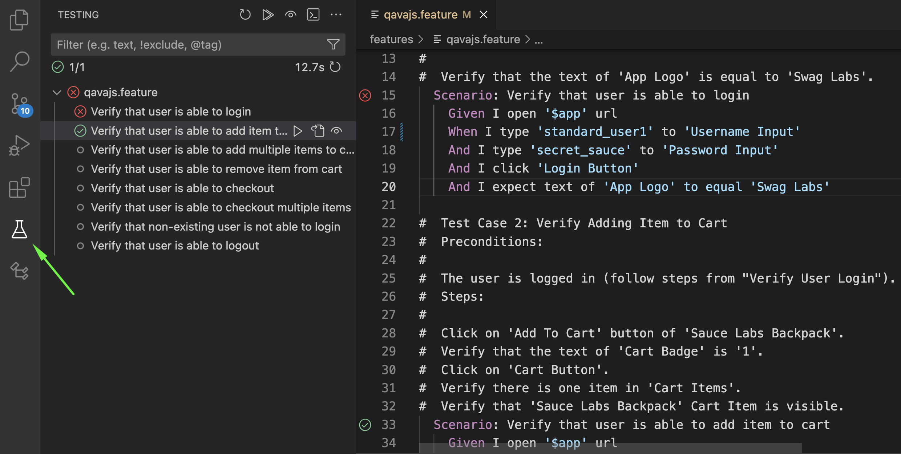

# qavajs VSCode extension

This is an extension based on Cucumber official plugin and enables support of qavajs framework features.

## Features

- VSCode Test Explorer

## Extension Settings

This extension contributes the following settings:

* `cucumber.features`: gherkin files paths (array)
* `cucumber.glue`: step definition file paths (array)
* `qavajs.launchProfiles`: named launch profiles for the Test Explorer dropdown (array of `{ name, command }`)
* [Deprecated] `qavajs.launchCommand`: qavajs launch command (default: `npx qavajs run`) (string)

```json
{
    "files.associations": {
        "*.feature": "cucumber"
    },
    "cucumber.features": [
        "features/**/*.feature"
    ],
    "cucumber.glue": [
        "node_modules/@qavajs/**/src/*.ts",
        "step_definition/*.ts"
    ],
    "qavajs.launchCommand": "npx qavajs run --config config.ts",
    "qavajs.launchProfiles": [
        { "name": "Dev", "command": "npx qavajs run --config dev.config.ts" },
        { "name": "CI", "command": "npx qavajs run --config ci.config.ts" }
    ]
}
```

When `qavajs.launchProfiles` is set, each profile appears as a separate entry in the Test Explorer run dropdown. The first profile is used by default. When the array is empty, `qavajs.launchCommand` is used.

## How To Use

### Test Explorer


## Known Issues and Limitation

* typescript projects require installed `ts-node`
* @qavajs/core > 2
