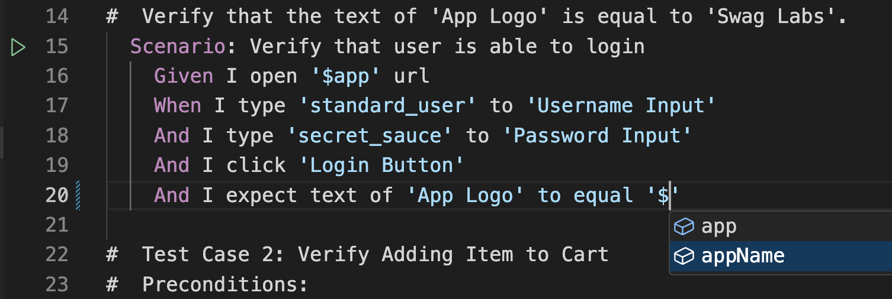

# qavajs README

This is extension based on Cucumber official plugin and enables support of qavajs framework features.

## Features

- VSCode Test Explorer
- Template Autocomplete
- Constants Autocomplete
- Page Object Autocomplete
- Page Object Explorer

## Extension Settings

This extension contributes the following settings:

* `cucumber.features`: gherkin files paths (array)
* `cucumber.glue`: step definition file paths (array)
* `qavajs.templates`: templates files paths (array)
* `qavajs.pageObject`: page object root file path (string)
* `qavajs.memory`: memory root file path (string)
* `qavajs.launchCommand`: qavajs launch command (default: `npx qavajs run`) (string)

```json
{  
    "files.associations": {
        "*.feature": "cucumber"
    },
    "cucumber.features": [
        "features/**/*.feature"
    ],
    "cucumber.glue": [
        "node_modules/@qavajs/**/src/*.ts",
        "step_definition/*.ts"
    ],
    "qavajs.templates": [
        "templates/*.feature"
    ],
    "qavajs.pageObject": "page_object/index.ts",
    "qavajs.memory": "memory/index.ts",
}
```

## How To Use

### Test Explorer


### Page Object Explorer
Click copy icon to copy qavajs path


### Page Object Autocomplete
Type ?


### Constants Autocomplete
Type $


## Known Issues and Limitation

* typescript projects require installed `ts-node`
* @qavajs/cli > 0.34.2
